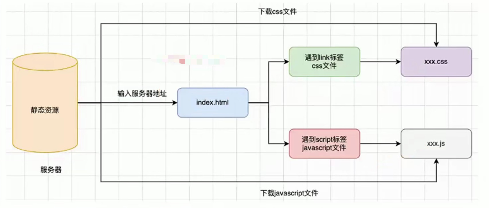
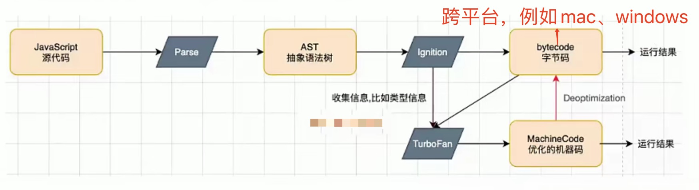

# JS 高级语法运用笔记

## JS 是一门高级的编程语言

从编程语言发展史来说，划分三个阶段： 

- **机器语言：** 100010011，一些机器指令
- **汇编语言：** mov，ax，bx，一些汇编指令
- **高级语言：** C，C++，Java，JavaScript 等

## 浏览器工作原理

从输入地址后浏览器的工作：

## 浏览器内核和 JS 引擎的关系

- 以 WebKit 为例，WebKit 由两部分组成，分别是： 
  `WebCore`：负责 HTML 解析、布局、渲染等。 
  `JavaScriptCore`：解析、执行 JavaScript 代码 
- 小程序里面的 JavaScript 代码就是被 JavaScriptCore 执行的
- JS 代码由 JS 引擎转换成 CPU 指令来执行

## 什么是 V8 引擎

- V8 是用 C++ 编写的开源高性能 JavaScript 和 WebAssembly 引擎，它已被用于 Chrome 和 Node.js 等。
- 可以运行在 Windows 7+，macOS 10.12+和使用 x64，IA-32，ARM 或 MIPS 处理器的 Linux 系统上。
- V8 可以独立运行，也可以嵌入到任何 C++ 应用程序中。

## V8 执行详情

- Blink 内核把源码交给 V8，Stream 获取到源码并且进行编码转换
- Scanner 会进行`词法分析`，词法分析会将代码转换成 tokens
- tokens 经过 Parser 和 PreParser，会被转换成 AST： 
  1、Parser 就是直接把 tokens 转成 AST 树 
  2、PreParser 叫预解析，为什么需要预解析？ 
  因为一开始就将所有的 JavaScript 代码全部转换 AST，会降低效率。所以 V8 实现了一个 `Lazy Parsing（延迟解析）`，作用是将不必要的函数预解析，就是暂时解析需要的内容，而对`函数的全量解析`是在`函数被调用时`才会进行。 
  **整个流程：** 
  JavaScript 代码 -> Parse -> AST 抽象语法树 -> Ignition -转换成字节码-> bytecode 字节码 -> CPU 运行的机器指令。 
  **注释：** 
  **bytecode 字节码的作用**：用来跨平台转换成 bytecode 字节码后可以在 iOS、Windows、Linux 等系统上执行。 
  bytecode 字节码可以再通过 TurboFan 模块把重复执行的代码逻辑转换成机器码，然后各平台`高效率`执行。如果后面重复代码逻辑变更再转交给 bytecode 字节码重新翻译成机器码执行。 
  
