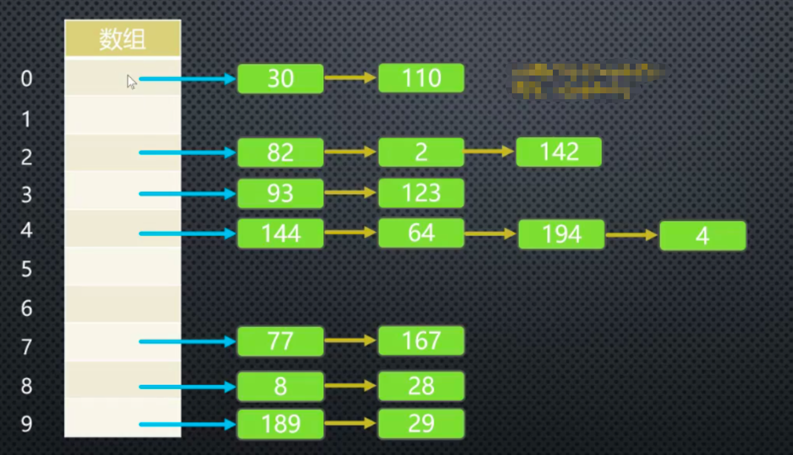
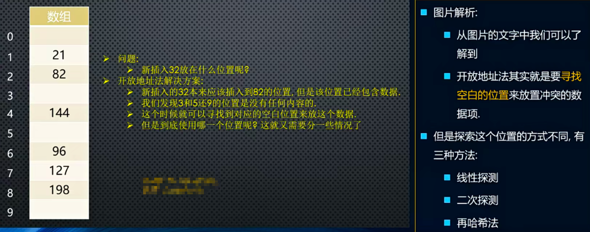

# 数据结构 和 算法

- 线性结构
  - 数组
  - 栈
  - 队列
  - 链表
- 哈希表
- 树结构
  - 二叉树
- 图结构
- 排序 & 搜索

## 数据结构

### 数组 => JS 原生支持，不多赘述

### 栈（Stack） => 一种受限的线性结构，后进先出（LIFO => last in first out）

举个 🌰：面试题

> 有六个元素 6,5,4,3,2,1 的顺序进栈，问下列哪一个不是合法的出栈序列？<br>
> A. 5 4 3 6 1 2 <br>
> B. 4 5 3 2 1 6 <br>
> C. 3 4 6 5 2 1 <br>
> D. 2 3 4 1 5 6

正确答案： C

> 解析： <br>
> A. 6 5 进栈，5 出栈，4 进栈出栈，3 进栈出栈，6 出栈，2 1 进栈，1 出栈 2 出栈 <br>
> B. 6 5 4 进栈，4 出栈，5 出栈，3 进栈出栈， 2 进栈出栈，1 进栈出栈，6 出栈 <br>
> D. 6 5 4 3 2 进栈，2 出栈，3 出栈，4 出栈，1 进栈出栈，5 出栈，6 出栈

#### 栈的操作

- push(element) 添加新元素到栈顶
- pop() 移除栈顶元素
- peek() 返回栈顶元素，不对栈做任何操作
- isEmpty() 空栈返回 true，否则反之
- size() 返回栈的元素个数
- toString() 将栈结构内容以字符串形式返回

```javascript
class Stack {
  items = [];

  push(element) {
    this.items.push(element);
  }

  pop() {
    return this.items.pop();
  }

  peek() {
    return this.items[this.items.length - 1];
  }

  isEmpty() {
    return this.items.length === 0;
  }

  size() {
    return this.items.length;
  }

  toString() {
    let str = "";
    for (let i = 0; i < this.items.length; i++) {
      str += `${this.items[i]} `;
    }
    return str;
  }
}

const s = new Stack();
s.push(1);
s.push(23);
s.push(89);
s.push(66);

console.log(s); // 1, 23, 89, 66

s.pop();
s.pop();

console.log(s); // 1, 23
console.log(s.size()); // 2
console.log(s.peek()); // 23
console.log(s.isEmpty()); // false
console.log(s.toString()); // 1 23
```

十进制转换二进制（利用栈的特性）

```js
// 十进制转换二进制，就是用被除数不断的取2的余数，然后压栈，再用整数继续取2的余数，然后出栈即是二进制的值。

const dec2bin = (decNumber) => {
  if (typeof decNumber !== "number") return;
  // 1、定义一个栈
  const stack = new Stack();

  // 2、循环操作
  while (decNumber > 0) {
    // 2.1、取余压栈
    stack.push(decNumber % 2);
    // 2.2、向下取整
    decNumber = Math.floor(decNumber / 2);
  }

  // 3、从栈中取出 0 or 1
  let binaryString = "";
  while (!stack.isEmpty()) {
    binaryString += stack.pop();
  }
  return binaryString;
};
```

### 队列（Queue）=> 一种受限的线性表，先进先出（FIFO => first in first out）

#### 队列的操作

- enqueue(element) 添加新元素到队列
- dequeue() 移除首个元素
- front() 返回队列第一个元素，但不删除该元素
- isEmpty() 空队列返回 true，否则反之
- size() 返回队列的元素个数
- toString() 将队列结构内容以字符串形式返回

```js
// 可以使用数组 or 链表实现，链表实现性能更高。
class Queue {
  items = [];

  enqueue(element) {
    this.items.push(element);
  }

  dequeue() {
    return this.items.shift();
  }

  front() {
    return this.items[0];
  }

  isEmpty() {
    return this.items.length !== 0;
  }

  size() {
    return this.items.length;
  }

  toString() {
    let str = "";
    for (let i = 0; i < this.items.length; i++) {
      str += `${this.items[i]} `;
    }
    return str;
  }
}

const queue = new Queue();

queue.enqueue("abc");
queue.enqueue("cba");
queue.enqueue("nba");

console.log(queue); // abc cba nba

queue.dequeue();
console.log(queue); // cba nba

console.log(queue.front()); // cba
console.log(queue.size()); // 2
console.log(queue.isEmpty()); // false
```

击鼓传花

```js
const passGame = (nameList, num) => {
  // 1、声明队列
  const queue = new Queue();

  // 2、存放
  for (let i = 0; i < nameList.length; i++) {
    queue.enqueue(nameList[i]);
  }

  // 3、遍历最后一个
  while (queue.size() > 1) {
    for (let i = 0; i < num - 1; i++) {
      queue.enqueue(queue.dequeue());
    }
    queue.dequeue();
  }
  const endName = queue.front();

  return nameList.indexOf(endName);
};

const names = ["Lucy", "Tom", "Lily", "Xiaoming", "Xiaohong"];
const index = passGame(names, 3); // 3 => Xiaoming
```

优先级队列

```js
class PriorityQueue {
  // 内置对象
  QueueElement = class {
    constructor(element, priority) {
      this.element = element;
      this.priority = priority;
    }
  };

  items = [];

  enqueue(element, priority) {
    // 创建 QueueElement 对象
    const qe = new this.QueueElement(element, priority);

    // 判断队列是否为空
    if (this.items.length === 0) {
      this.items.push(qe);
    } else {
      let added = false;
      for (let i = 0; i < this.items.length; i++) {
        if (qe.priority < this.items[i].priority) {
          this.items.splice(1, 0, qe);
          added = true;
          break;
        }
      }

      if (!added) {
        this.items.push(qe);
      }
    }
  }

  dequeue() {
    return this.items.shift();
  }

  front() {
    return this.items[0];
  }

  isEmpty() {
    return this.items.length !== 0;
  }

  size() {
    return this.items.length;
  }

  toString() {
    let str = "";
    for (let i = 0; i < this.items.length; i++) {
      str += `${this.items[i].element} ${this.items[i].priority} `;
    }
    return str;
  }
}

const qe = new PriorityQueue();
qe.enqueue("ac", 1);
qe.enqueue("ab", 200);
qe.enqueue("qw", 110);
qe.enqueue("good job", 50);

console.log(qe);
```

### 单向链表

- append(element) 向列表尾部添加一个新元素
- insert(position, element) 向列表指定位置插入一个新元素
- get(position) 获取对应位置元素
- indexOf(element) 返回元素在列表中的索引，如果列表没有该元素则返回 -1
- update(position, element) 修改某个位置的元素
- removeAt(position) 从列表的特定位置移除一项
- remove(element) 从列表中移除一项
- isEmpty() 如果链表中不包含任何元素，返回 true，如果链表长度大于 0 则返回 false
- size() 返回链表包含的元素个数，与数组的 length 属性类似
- toString() 由于列表项使用了 Node 类，就需要重写继承自 JS 对象默认的 toString 方法，让其只输出元素的值。

```js
class LinkedList {
  // 内部节点类
  Node = class {
    constructor(data) {
      this.data = data;
      this.next = null;
    }
  };
  // 属性
  head = null;
  length = 0;

  // 追加方法
  append(data) {
    // 1、创建新节点
    const newNode = new this.Node(data);

    // 判断是否是第一个节点
    if (this.length === 0) {
      // 是第一个节点
      this.head = newNode;
    } else {
      // 不是第一个节点
      // 找到最后一个节点
      let current = this.head;

      while (current.next) {
        current = current.next;
      }

      // 最后节点的 next 指向新的节点
      current.next = newNode;
    }
    // 这种写法适用大多数语言
    this.length += 1;
  }

  // toString 方法
  toString() {
    // 定义变量
    let current = this.head;
    let listString = "";

    while (current) {
      listString += `${current.data} `;
      current = current.next;
    }
    return listString;
  }

  // 插入元素
  insert(position, data) {
    // 对 position 进行越界判断
    if (position < 0 || position > this.length) return false;

    // 根据 data 创建 newNode
    const newNode = new this.Node(data);

    // 判断插入位置是否为第一个
    if (position === 0) {
      newNode.next = this.head;
      this.head = newNode;
    } else {
      let index = 0;
      let current = this.head;
      let previous = null;

      while (index++ < position) {
        previous = current;
        current = current.next;
      }

      newNode.next = current;
      previous.next = newNode;
    }

    // length +1
    this.length += 1;

    return true;
  }

  // 获取元素
  get(position) {
    // 越界判断
    if (position < 0 || position >= this.length) return null;

    // 获取元素
    let current = this.head;
    let index = 0;
    while (index++ < position) {
      current = current.next;
    }
    return current.data;
  }

  // 查询元素索引值
  indexOf(data) {
    let current = this.head;
    let index = 0;

    while (current) {
      if (current.data === data) {
        return index;
      }
      current = current.next;
      index += 1;
    }

    return -1;
  }

  // 修改某个位置元素
  update(position, data) {
    // 越界判断
    if (position < 0 || position >= this.length) return false;

    let current = this.head;
    let index = 0;

    while (index++ < position) {
      current = current.next;
    }

    current.data = data;
    return true;
  }

  // 删除某个元素
  removeAt(position) {
    // 越界判断
    if (position < 0 || position >= this.length) return null;

    let current = this.head;
    // 判断是否删除第一个元素
    if (position === 0) {
      this.head = this.head.next;
    } else {
      let index = 0;
      let previous = null;
      while (index++ < position) {
        previous = current;
        current = current.next;
      }
      // 前一个元素的 next 指向当前元素的 next，即代表删除当前元素
      previous.next = current.next;
    }

    this.length -= 1;

    return current.data;
  }

  // remove 方法
  remove(data) {
    // 得到元素索引
    const position = this.indexOf(data);

    // 删除索引元素
    return this.removeAt(position);
  }

  isEmpty() {
    return this.length === 0;
  }

  size() {
    return this.length;
  }
}
```

### 双向链表

- append(element) 向列表尾部添加新元素
- insert(position, element) 向列表的特定位置插入一个新元素
- get(position) 获取对应位置的元素
- indexOf(element) 返回元素在列表中的索引，如果没有则返回 -1
- update(position, element) 修改某个位置的元素
- removeAt(position) 从列表的特定位置移除一项
- remove(element) 从列表中移除一项
- isEmpty() 链表是否包含元素，包含返回 true，否则返回 false
- size() 返回链表包含的元素个数，与数组的 length 属性类似
- toString() 由于列表使用了 Node 类，就需要重写继承自 JS 对象默认的 toString 方法，让其只输出元素的值
- forwardString() 返回正向遍历的节点字符串形式
- backwardString() 返回反向遍历的节点字符串形式

```js
class DoublyLinkedList {
  // 内部类：节点类
  Node = class {
    constructor(data) {
      this.data = data;
      this.prev = null;
      this.next = null;
    }
  };

  // 属性
  head = null; // 链表头
  tail = null; // 链表尾
  length = 0; // 链表长度

  append(data) {
    // 创建 node 节点
    const newNode = new this.Node(data);

    if (this.length === 0) {
      this.head = newNode;
      this.tail = newNode;
    } else {
      newNode.prev = this.tail;
      this.tail.next = newNode;
      this.tail = newNode;
    }

    // 长度 +1
    this.length += 1;
  }

  toString() {
    return this.backwardString();
  }

  forwardString() {
    // 定义变量
    let current = this.tail;
    let resultString = "";

    // 依次向前遍历，获取每一个节点
    while (current) {
      resultString += `${current.data} `;
      current = current.prev;
    }

    return resultString;
  }

  backwardString() {
    // 定义变量
    let current = this.head;
    let resultString = "";

    // 依次向后遍历，获取每一个节点
    while (current) {
      resultString += `${current.data} `;
      current = current.next;
    }

    return resultString;
  }

  // insert 方法
  insert(position, data) {
    // 对 position 进行越界判断
    if (position < 0 || position > this.length) return false;

    // 根据 data 创建 newNode
    const newNode = new this.Node(data);

    // 判断是否是第一个元素
    if (this.length === 0) {
      this.head = newNode;
      this.tail = newNode;
    } else {
      if (position === 0) {
        // 当 position 为 0 时
        this.head.prev = newNode;
        newNode.next = this.head;
        this.head = newNode;
      } else if (position === this.length) {
        // 当 position 等于 链表长度时，相当于 append
        newNode.prev = this.tail;
        this.tail.next = newNode;
        this.tail = newNode;
      } else {
        // 其他情况，中间插入
        let current = this.head;
        let index = 0;

        while (index++ < position) {
          current = current.next;
        }

        // 修改指针
        newNode.next = current;
        newNode.prev = current.prev;
        current.prev.next = newNode;
        current.prev = newNode;
      }
    }

    // length +1
    this.length += 1;

    return true;
  }

  // get 方法
  get(position) {
    // position 越界判断
    if (position < 0 || position >= this.length) return null;

    if (this.length / 2 > position) {
      // this.length / 2 > position，从前往后遍历
      let current = this.head;
      let index = 0;

      while (index++ < position) {
        current = current.next;
      }

      return current.data;
    } else {
      // this.length / 2 < position，从后往前遍历
      let current = this.tail;
      let index = this.length - 1;

      while (index-- > position) {
        current = current.prev;
      }

      return current.data;
    }
  }

  indexOf(data) {
    // 定义变量
    let current = this.head;
    let index = 0;

    while (current) {
      if (current.data === data) {
        return index;
      }
      current = current.next;
      index += 1;
    }

    return -1;
  }

  // 更新元素
  update(position, data) {
    // position 越界判断
    if (position < 0 || position >= this.length) return false;

    if (this.length / 2 > position) {
      // this.length / 2 > position，从前往后遍历
      let current = this.head;
      let index = 0;

      while (index++ < position) {
        current = current.next;
      }

      current.data = data;
    } else {
      // this.length / 2 < position，从后往前遍历
      let current = this.tail;
      let index = this.length - 1;

      while (index-- > position) {
        current = current.prev;
      }

      current.data = data;
    }

    return true;
  }

  removeAt(position) {
    // 越界判断
    if (position < 0 || position >= this.length) return null;

    let current = this.head;
    // 当只存在一个数据时
    if (this.length === 1) {
      this.head = null;
      this.tail = null;
    } else {
      if (position === 0) {
        // 删除第一个元素
        this.head.next.prev = null;
        this.head = this.head.next;
      } else if (position === this.length - 1) {
        // 删除最后一个元素
        current = this.tail;

        current.prev.next = null;
        this.tail = current.prev;
      } else {
        // 其他情况
        let index = 0;

        while (index++ < position) {
          current = current.next;
        }

        current.prev.next = current.next;
        current.next.prev = current.prev;
      }
    }

    // length -1
    this.length -= 1;

    return current.data;
  }

  remove(data) {
    const position = this.indexOf(data);

    return this.removeAt(position);
  }

  isEmpty() {
    return this.length === 0;
  }

  size() {
    return this.length;
  }

  // 获取链表第一个元素值
  getHead() {
    return this.head.data;
  }

  // 获取链表最后一个元素值
  getTail() {
    return this.tail.data;
  }
}
```

### 集合

相当于一个特殊的数组，内部元素不能重复且是无序的。es6 有关键字 Set 来声明。

- add(value) 向集合中添加一个新元素
- remove(value) 从集合中移除某个元素
- has(value) 如果值在集合中，返回 true，否则返回 false
- clear() 移除集合中所有项
- size() 返回集合所包含元素的数量
- values() 返回一个包含集合中所有值的数组

```js
class Set {
  // 属性
  items = {};

  // 方法
  has(value) {
    return this.items.hasOwnProperty(value);
  }

  add(value) {
    if (this.has(value)) return false;

    this.items[value] = value;
    return true;
  }

  remove(value) {
    if (!this.has(value)) return false;

    delete this.items[value];
    return true;
  }

  clear() {
    this.items = {};
  }

  size() {
    return Object.keys(this.items).length;
  }

  values() {
    return Object.keys(this.items);
  }

  // 集合间的操作

  // 并集 A ∪ B
  union(otherSet) {
    let unionSet = new this.Set();

    let values = this.values();
    for (let i = 0; i < values.length; i++) {
      unionSet.add(values[i]);
    }

    values = otherSet.values();
    for (let i = 0; i < values.length; i++) {
      unionSet.add(values[i]);
    }

    return unionSet;
  }

  // 交集 A ∩ B
  intersection(otherSet) {
    const intersectionSet = new this.Set();

    const values = this.values();
    for (let i = 0; i < values.length; i++) {
      if (otherSet.has(values[i])) {
        intersectionSet.add(values[i]);
      }
    }

    return intersectionSet;
  }

  // 差集
  difference(otherSet) {
    const differenceSet = new this.Set();

    const values = this.values();
    for (let i = 0; i < values.length; i++) {
      if (!otherSet.has(values[i])) {
        differenceSet.add(values[i]);
      }
    }

    return differenceSet;
  }

  // 子集
  subset(otherSet) {
    const values = this.values();

    for (let i = 0; i < values.length; i++) {
      if (!otherSet.has(values[i])) {
        return false;
      }
    }

    return true;
  }
}
```

### 哈希表

#### 优点

- 提供非常快速的插入、删除、查找操作
- 无论多少数据，插入和删除都是 O1 时间级，实际上，只需要几个机器指令即可完成
- 哈希表速度比树还快，基本可以瞬间找到想要的数据
- 哈希表相对于树来说编码要容易很多

#### 缺点

- 哈希表的数据是没有顺序的
- 通常情况下，哈希表中的 key 是不允许重复的

#### 哈希表如果产生冲突（不同数据复用相同索引）怎么解决？

- 链地址法
- 开放地址法

##### 链地址法



上图所示，链地址法解决冲突的方法是`每个数组单元` 中存储的不再是`单个数据`，而是一个`链条`。<br>
链条可以是 `数组` or `链表`。

##### 开放地址法



开放地址法的主要工作方式是`寻找空白的单元格`来添加重复的数据。

- 线性探测：主要是 `index + 1` 步长去插入/查找操作
- 二次探测：主要是 `index + n^2` 步长去插入/查找操作(n 为 1,2,3,4...)
- 再哈希法：主要是 再次哈希位置，公式如下：<br>
  stepSize = constant - (key % constant)<br>
  constant 是质数，且小于数组的容量<br>
